# Those_Who_Knows_frontend_25-1
Proyecto frontend 25-1

# E0 :construction:

* :pencil2: **Nombre Grupo:** Those Who Knows

## Descripción general :thought_balloon:

## :iphone: ¿De qué tratará el proyecto?
El proyecto consistirá en el desarrollo de una aplicación que permitirá a los usuarios planificar sus rutinas de entrenamiento, registrar sus sesiones y hacer un seguimiento detallado de su progreso. La plataforma incluirá herramientas de análisis que facilitarán la evaluación continua del rendimiento físico.

## :bulb: ¿Cuál es el fin o la utilidad del proyecto?
El objetivo principal es ofrecer a deportistas individuales y equipos una solución integral para gestionar y optimizar sus entrenamientos. La aplicación permitirá a los usuarios identificar fortalezas, detectar áreas de mejora y tomar decisiones basadas en datos. En el caso de equipos, los entrenadores podrán gestionar entrenamientos grupales, acceder a los registros de sus atletas y monitorear su evolución de manera personalizada.

## :busts_in_silhouette: ¿Quiénes son los usuarios objetivo de la aplicación?
Está dirigida a personas del ámbito deportivo, como deportistas amateurs y profesionales, entrenadores, kinesiólogos, nutricionistas, médicos del deporte y otros especialistas involucrados en la planificación y seguimiento del rendimiento físico.

## Historias de Usuarios :busts_in_silhouette:

1. Como deportista, quiero ver todos mis entrenamientos programados, para planificar mi asistencia y preparación.

2. Como entrenador, quiero crear y modificar entrenamientos para mis deportistas, para organizar mejor las sesiones.

3. Como entrenador, quiero registrar la asistencia de mis deportistas, para llevar un control de su compromiso.

4. Como deportista, quiero poder marcar mi propia asistencia, para mantener el registro en caso de omisión del entrenador.

5. Como entrenador, quiero agregar notas a los entrenamientos, para detallar las actividades realizadas y los objetivos.

6. Como deportista, quiero ver las notas de los entrenamientos pasados, para repasar lo aprendido y mejorar.

7. Como deportista, quiero establecer metas personales dentro de la plataforma, para enfocarme en mi desarrollo.

8. Como entrenador, quiero visualizar el progreso de cada deportista, para brindar retroalimentación personalizada.

9. Como deportista, quiero registrar mis avances y progreso, para ver cómo evoluciono a lo largo del tiempo.

10. Como usuario (cualquier rol), quiero recibir recordatorios de eventos y entrenamientos, para no olvidar ninguna sesión importante.

11. Como administrador, quiero gestionar los accesos de usuarios y roles, para mantener el orden y la seguridad de la plataforma.

12. Como usuario, quiero personalizar la apariencia del planificador, para trabajar con una interfaz que se adapte a mis preferencias.

## Diagrama Entidad-Relación :scroll:
<!-- Insertamos la imagen ER-Model.png -->
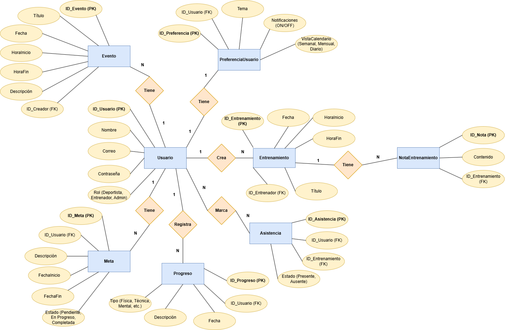

## Diseño Web :computer:

<!-- Documento de diseño web -->
### :art: Documento de diseño

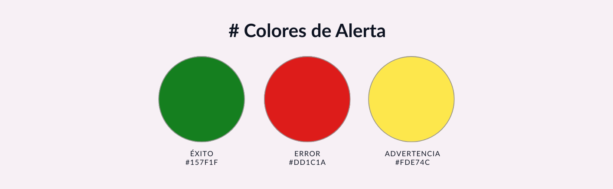
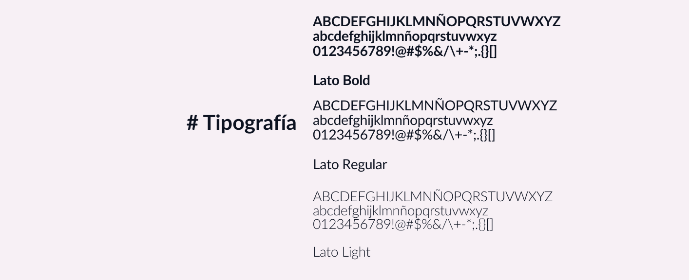

<!-- Vistas principales -->
### :mag: Vistas principales
## Landing page Mockups
| 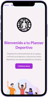 | 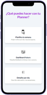 | 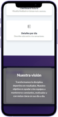 |
|:-----------------------------------------------:|:-----------------------------------------------:|:-----------------------------------------------:|

|  | 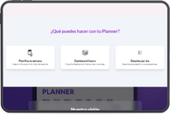 |
|:----------------------------:|:----------------------------:|

| 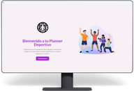 |  |
|:----------------------------:|:----------------------------:|

## About Us page Mockup
| 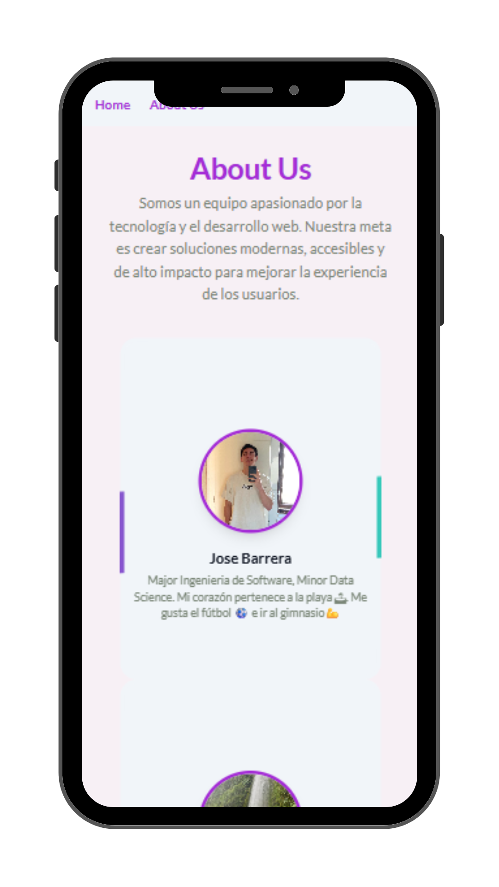 | 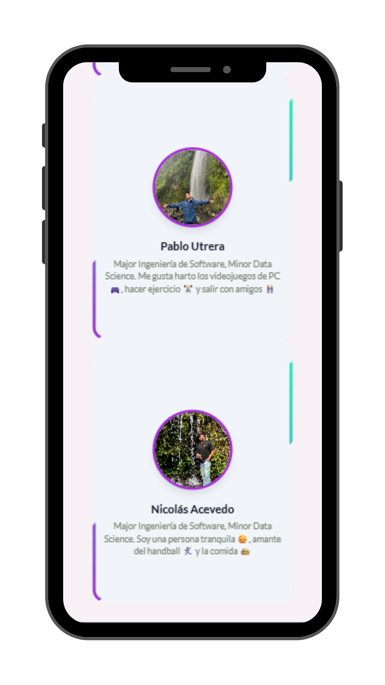 |
|:-----------------------------------------------:|:-----------------------------------------------:|

| 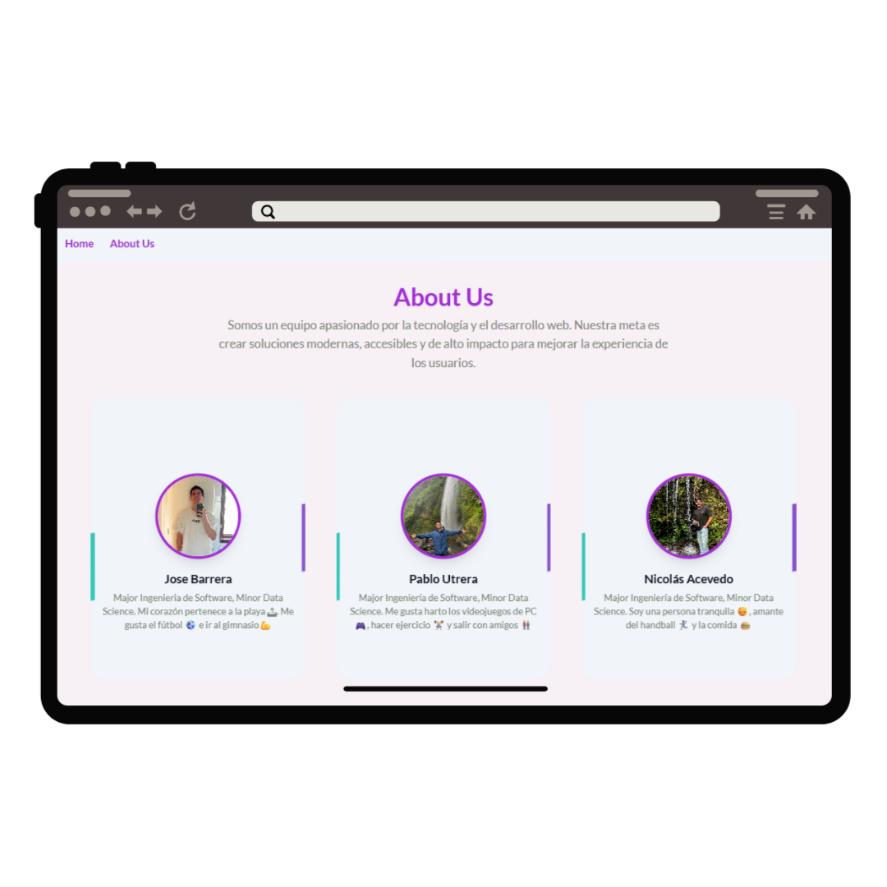 |
|:----------------------------:|

| 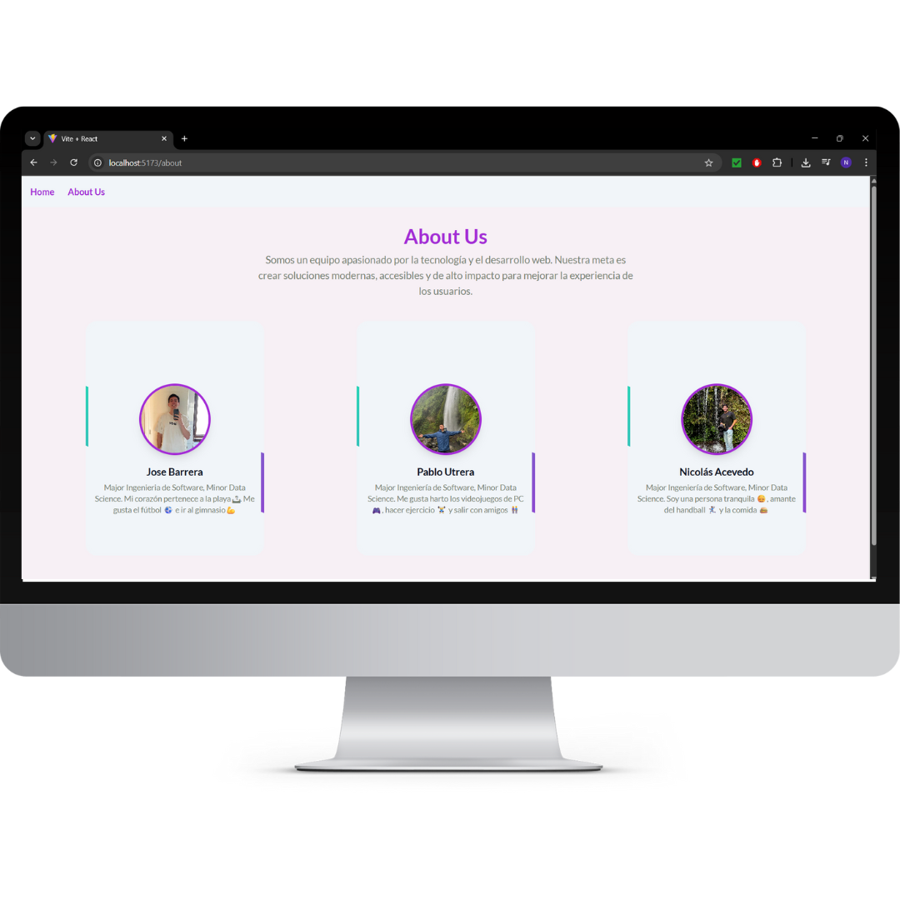 |
|:----------------------------:|

## Profile page Mockup
| 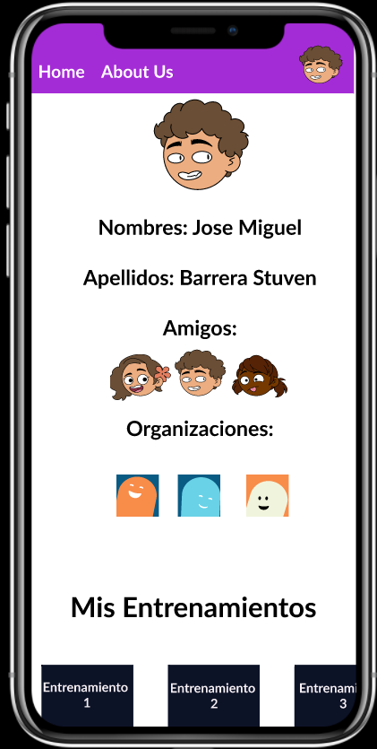 | 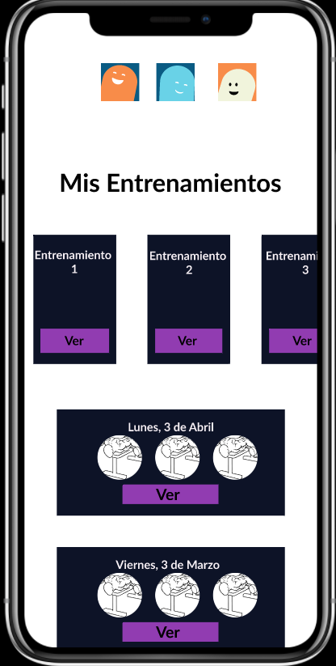 |
|:-----------------------------------------------:|:-----------------------------------------------:|

| 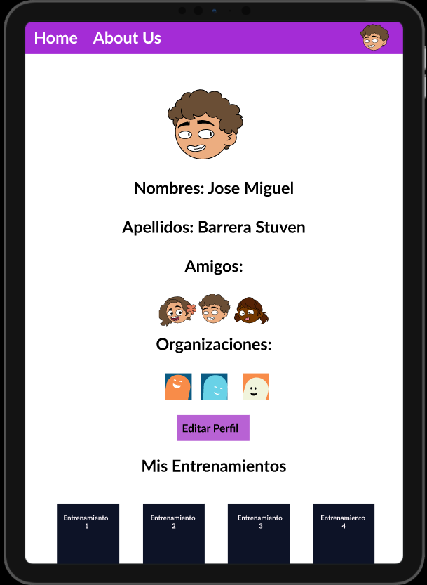 | 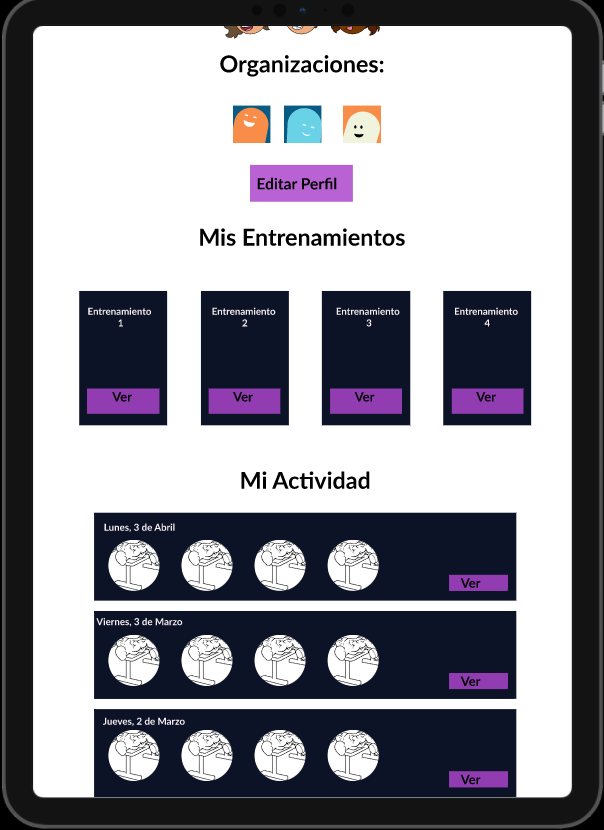
|:----------------------------:|:----------------------------:|

| 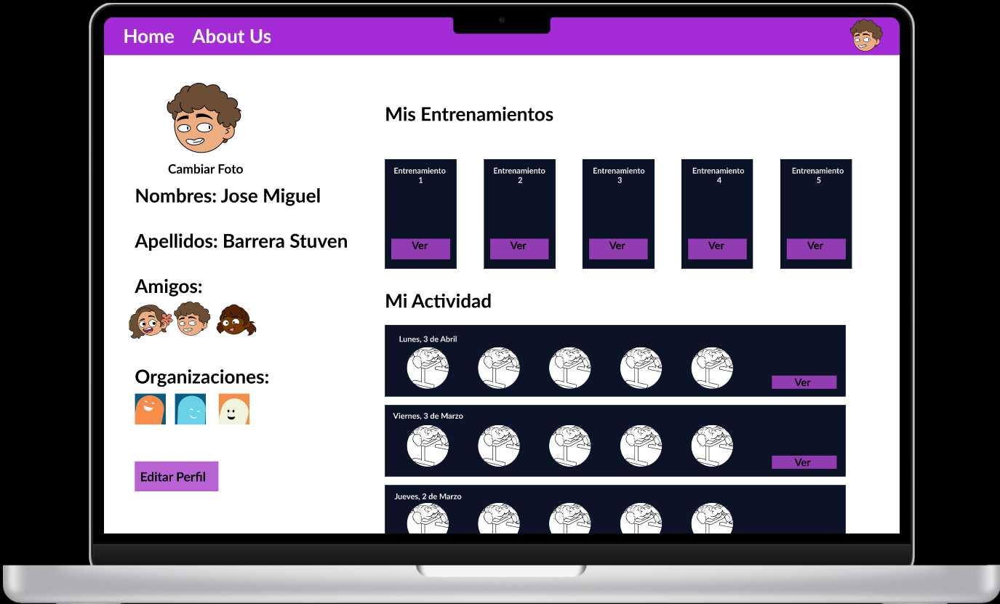 |

<!-- Logo -->
### :art: Logo
|  |  |
|:----------------------------:|:-----------------------------------------------:|

<!-- ejemplo de aplicacion -->
### :iphone: Ejemplo de aplicación
## Landing Page
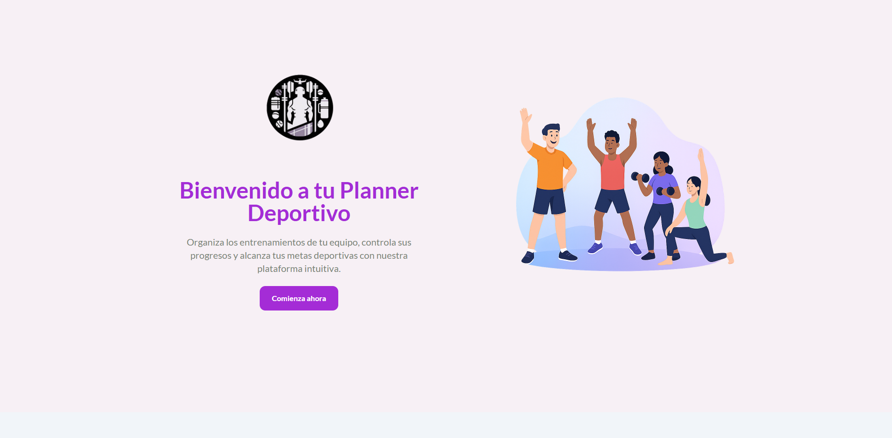
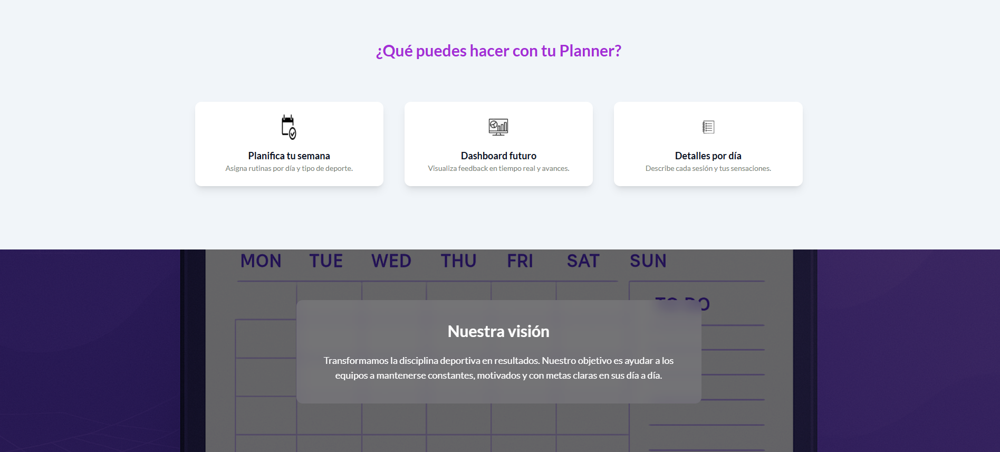
## About Us
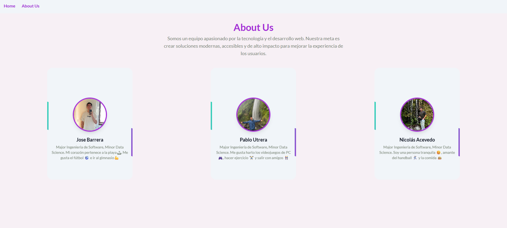
<!-- [Ejemplo de aplicación](assets/PatternApplication.png) -->

<!-- citas -->
### citas

- Card utilizada para AboutUsCard https://uiverse.io/bhaveshxrawat/dangerous-quail-58 de bhaveshxrawat